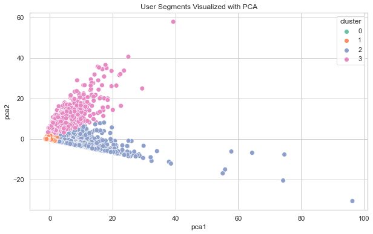

# Customer Segmentation Engine

This project is based on a public dataset from Kaggle: https://www.kaggle.com/datasets/mkechinov/ecommerce-behavior-data-from-multi-category-store?resource=download
The full raw data is not included due to size, but all processed features used in modeling are provided.

This project demonstrates a complete end-to-end workflow for customer segmentation using real-world e-commerce clickstream data. The goal is to cluster users based on behavioral patterns and derive actionable business insights.

## Project Overview
We used a Kaggle dataset containing over 1 million behavioral events (views, carts, purchases) and built a clustering pipeline to identify distinct customer segments.

## 🛠 Tools & Techniques
- **Python**, **Pandas**, **Scikit-learn** for feature engineering and clustering
- **K-Means Clustering** and **PCA** for unsupervised segmentation and visualization
- **Streamlit** for building an interactive dashboard
- **Matplotlib** and **Seaborn** for data visualization

##  Workflow Summary
1. Cleaned and processed clickstream data
2. Engineered features like conversion rate, product diversity, sessions, etc.
3. Applied K-Means clustering and optimized k using Elbow method
4. Reduced dimensions using PCA for 2D visualization
5. Labeled and profiled clusters for business interpretation
6. Built a Streamlit dashboard for segment exploration and CSV export

##  Identified Segments
- **Loyal Buyers** – high conversion and cart-to-purchase ratios
- **Window Shoppers** – high views, low conversions
- **Passive Browsers** – limited activity, no purchases
- **Non-Engaged Users** – minimal interaction

##  Files
- `cust_segmentation_beautified.ipynb` – full notebook with clean markdowns
- `customer_segmentation_app.py` – Streamlit dashboard code
- `data/user_behavior_features.csv` – cleaned dataset with features and clusters

## Sample Visual


---

##  How to Run the Dashboard

```bash
streamlit run customer_segmentation_app.py
```

##  Contributions
Feel free to fork, improve, or connect with me for suggestions and collaborations.
